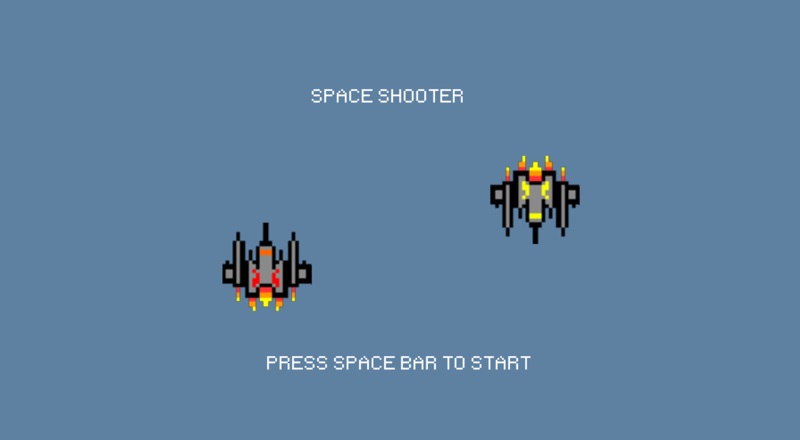
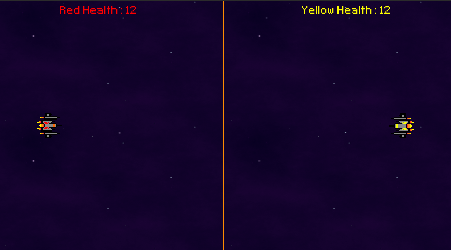

# Fighter Duel
## CS110 Final Project  Fall,2023

## Team Members

- Ousmane Diallo
- Christian Zuniga

***

## Project Description

For our final project, we want to create a two-player game where two spaceships, facing each other horizontally, will fight by firing laser bolts under one side has hit the other a certain number of times. Class-main is draft 1 and main is draft 2. To run program git clone and cd into final-project-team-space directory and run main.py script

***    

## GUI Design

### Initial Design

### Final Design

## Program Design

### Features

1. Two player controls
2. Vertical and Horizontal movement from both spaceships
3. Creation of moving projectiles
4. Moving background
5. Score tracker

### Classes

Spaceship: The Spaceship class represents a generic spaceship in a Pygame-based game. It handles the initialization of the spaceship, creates loading images, and renders start menu text.

YellowSpaceship: YellowSpaceship is a subclass of Spaceship, representing a yellow spaceship in the game. It inherits spaceship attributes and movement methods, specific to yellow spaceship controls.

RedSpaceship: RedSpaceship, another subclass of Spaceship, represents a red spaceship in the game. Similar to YellowSpaceship, it inherits generic spaceship functionalities and has its own movement controls.

GameManager: The GameManager class is responsible for managing game elements such as bullets, their movement, and collision detection. It also handles the drawing of the game window.

SpaceShooterGame: SpaceShooterGame is the main class representing the entire space shooter game. It initializes the game window, spaceships, manages game state, and contains the main loop for handling events, updating the game, and rendering the screen.

## ATP
Program: "Space Shooter"

Test Case 1: Player One Movement Test Description: Check that Player One's spaceship moves up, down, left, and right. Test Steps: 1. Start the game by pressing the Space Bar. 2. Press the W key. 3. Ensure Player One's spaceship moves up 4. Press the A key. 5. Ensure that Player One's spaceship moves backward 6. Press the S key. 7. Ensure that Player One's spaceship moves down 8. Press the D key. 9. Ensure that Player One's spaceship moves forward Expected Outcome: Player One's spaceship should be able to move up, down, left, and right based on the WASD keys.

Test Case 2: Player Two Movement Test Description: Check that Player Two's spaceship moves up, down, left, and right. Test Steps: 1. Start the game by pressing the Space Bar. 2. Press the Up key. 3. Ensure that Player One's spaceship moves up 4. Press the Left key. 5. Ensure that Player One's spaceship moves backward 6. Press the Down key. 7. Ensure that Player One's spaceship moves down 8. Press the Right key. 9. Ensure that Player One's spaceship moves forward Expected Outcome: Player Two's spaceship should be able to move up, down, left, and right based on the arrow keys.

Test Case 3: Projectile Input Test Description: Ensure that both players fire a projectile that moves across the screen Test Steps: 1. Begin the game by pressing the Space Bar. 2. Press the left control key 3. Ensure that Player One's spaceship fires a projectile from their position 4. Press the right control key 5. Ensure that Player Two's spaceship fires a projectile from their position Expected Outcome: Both players' spaceships should fire a projectile in the shape of a line that moves across the screen.

Test Case 4: Projectile Detection Test Description: Ensure that the projectile and the opposing spaceship detect each other Test Steps: 1. Begin the game by pressing the Space Bar. 2. Fire a projectile using the left control key for Player One 3. Ensure that Player One's projectile detects Player Two's spaceship when they collide with each other 4. Fire another projectile using the left control key for Player One 5. Ensure that the projectile misses and detects nothing 6. Fire a projectile using the right control key for Player Two 7. Ensure that Player Two's projectile detects Player One's spaceship when they collide with each other 8. Fire another projectile using the right control key for Player Two 9. Ensure that the projectile misses and detects nothing Expected Outcome: The projectiles from each spaceship should be able to detect the opposing spaceship when colliding and detect nothing when missing.

Test Case 5: Health Test Description: Ensure that both players' spaceships have a correctly displayed health counter that can be decremented Test Steps: 1. Begin the game by pressing the Space Bar. 2. Ensure that the titles "Red Health" and "Yellow Health" are in the top middle of the screen. 3. Ensure that "12" is next to both titles to represent their health value 4. Fire a projectile from Player One's spaceship using the left control key. 5. Have the projectile hit Player Two's spaceship 6. Ensure that Player Two's "Yellow Health" title has its value of 12 reduced by one. 7. Fire a projectile from Player Two's spaceship using the right control key. 8. Have the projectile hit Player One's spaceship 9. Ensure that Player One's "Red Health" title has its value of 12 reduced by one. Expected Outcome: The projectiles from each player should be able to damage the opponent by one health point when they collide, starting from 12 health.
