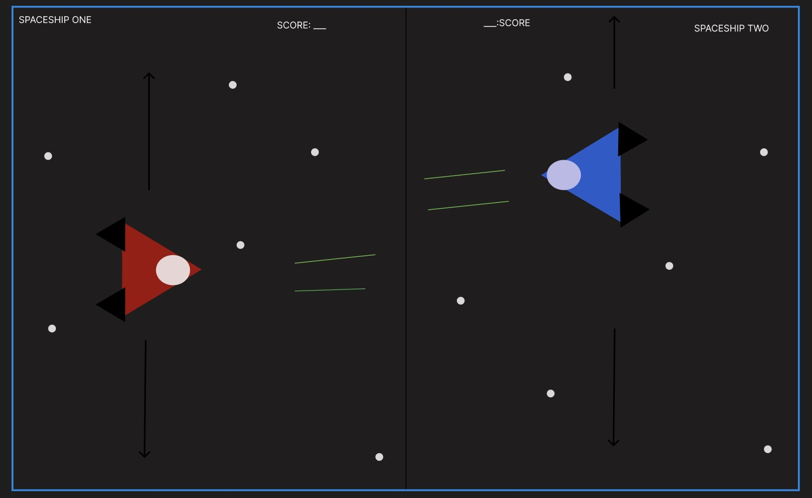

:warning: Everything between << >> needs to be replaced (remove << >> after replacing)

# Fighter Duel
## CS110 Final Project  Fall,2023

## Team Members

- Ousmane Diallo
- Christian Zuniga

***

## Project Description

For our final project, we want to create a two-player game where two spaceships, facing each other horizontally, will fight by firing laser bolts under one side has hit the other a certain number of times.

***    

## GUI Design

### Initial Design

### Final Design

## Program Design

### Features

1. Two player controls
2. Vertical movement from both spaceships
3. Creation of moving projectiles
4. Moving background
5. Score tracker

### Classes

- Spaceship
Description: Creates the sprite object for the creation of the two playable spaceships and sets the text for the start screen

- RedSpaceship
Description: Loads in the image for the red spaceship and handles its movement

-YelowSpaceship
Description: Loads in the image for the yellow spaceship and handles its movement

-Projectiles:
Description: Creates the projectile object needed for each spaceship to us

-Health:
Description: Creates the health values of each spaceship

## ATP

Program: "Space Shooter"

Test Case 1: Player One Movement
Test Description: Check that Player One's spaceship moves up, down, left, and right.

Test Steps:
    1. Start the game from the start screen
    2. Press the W key.
    3. Ensure that Player One's spaceship moves up
    4. Press the A key.
    5. Ensure that Player One's spaceship moves backwards
    6. Press the S key.
    7. Ensure that Player One's spaceship moves down
    8. Press the D key.
    9. Ensure that Player One's spaceship moves forward
    
Expected Outcome: Player One's spaceship should be able to move up, down, left, and right based on the WASD keys.

Test Case 2: Player Two Movement
Test Description: Check that Player Two's spaceship moves up, down, left, and right.

Test Steps:
    1. Start the game from the start screen
    2. Press the Up key.
    3. Ensure that Player One's spaceship moves up
    4. Press the Left key.
    5. Ensure that Player One's spaceship moves backwards
    6. Press the Down key.
    7. Ensure that Player One's spaceship moves down
    8. Press the Right key.
    9. Ensure that Player One's spaceship moves forward
    
Expected Outcome: Player Two's spaceship should be able to move up, down, left, and right based on the arrow keys.

Test Case 3: Projectile Input 
Test Description: Ensure that both players fire a projectile that moves across the screen

Test Steps:
    1. Begin the game from the start screen
    2. Press the left shift key
    3. Ensure that Player One's spaceship fires a circle projectile from their position
    4. Press the right shift key
    5. Ensure that Player Two's spaceship fires a circle projectile from their position
    
Expected Outcome: Both players' spaceships should fire a projectile in the shape of a circle that moves across the screen.

Test Case 4: Projectile Detection
Test Description: Ensure that the projectile and the opposing spcaeship detect each other

Test Steps:
    1. Begin the game from the start screen
    2. Fire a projectile using the left shift key for Player One
    3. Ensure that Player One's projectile detects Player Two's spaceship when they collide with each other
    4. Fire another projectile using the left shift key for Player One
    5. Ensure that the projectile misses and detects nothing
    6. Fire a projectile using the right shift key for Player Two
    7. Ensure that Player Two's projectile detects Player One's spaceship when they collide with each other
    8. Fire another projectile using the right shift key for Player Two
    9. Ensure that the projectile misses and detects nothing
    
Expected Outcome: The projectiles from each spaceship should be able to detect the opposing spaceship when colliding and detect nothing when missing.

Test Case 5: Health
Test Description: Ensure that both players' spaceships have a correctly displayed health counter that can be decremented
    1. Begin the game from the start screen
    2. Ensure that Player One and Player Two have a title "Health" at the top middle of the screen
    3. Ensure that the number "5" is next to both "Health" titles to represent their health value
    4. Fire a projectile from Player One's spaceship
    5. Have the projectile hit Player Two's spaceship
    6. Ensure that Player Two's "Health" title has their value of 5 reduced by one
    7. Fire a projectile from Player Two's spaceship
    8. Have the projectile hit Player One's spaceship
    9. Ensure that Player One's "Health" title has their value of 5 reduced by one

Expected Outcome: The projectiles from each player should be able to damage the opponent by one health point when they collide, starting from 5 health.

